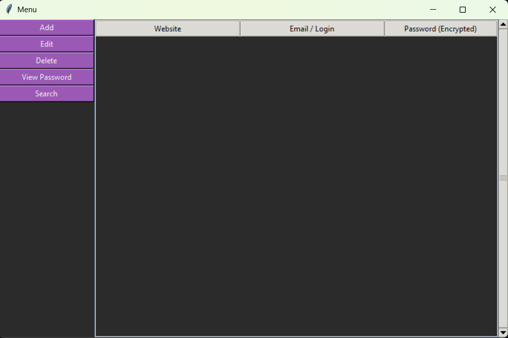

# 🔐 Password Manager (Python + C)

Desktop password manager with GUI written in **Python (Tkinter)**  
and cryptographic core implemented in **C (DLL via ctypes)**.

## 🚀 Features
- Master password authentication (C core)
- Password encryption/decryption (XOR, C)
- GUI with Tkinter
- Add / Edit / Delete / Search records
- Encrypted local storage
- Treeview-based UI
- Separation of GUI and core logic

## 🧠 Architecture
- Python — UI, logic, file handling
- C — encryption, master-key validation
- Communication via `ctypes` and DLL

## ▶️ Run
python GUI.py

## ⚠️ Disclaimer

This project is for educational purposes.
Encryption algorithm is simplified (XOR).

## 🖥️ Screenshots





## 🛠️ Build C core
```bash
gcc -shared -o manager.dll manager.c
<<<<<<< HEAD

## ▶️ Run
python GUI.py

## ⚠️ Disclaimer

This project is for educational purposes.
Encryption algorithm is simplified (XOR).
=======
>>>>>>> f2283a73c94a1dd1e9afb3ddf242e058a6ea19ef
