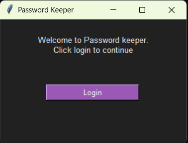
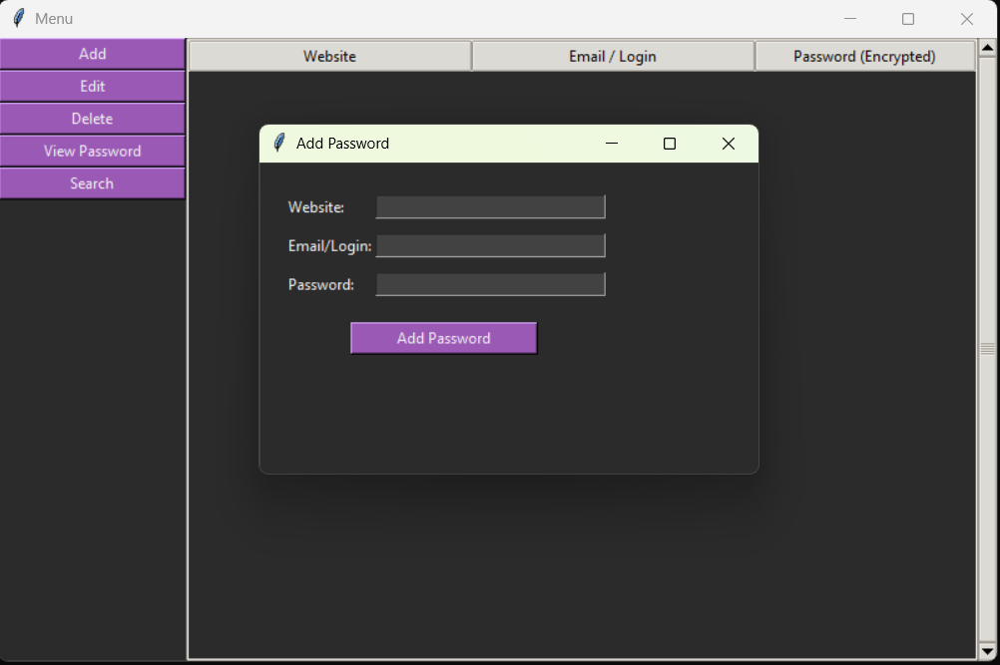

# 🔐 Password Manager (Python + C)

Desktop password manager with GUI written in **Python (Tkinter)**  
and cryptographic core implemented in **C (DLL via ctypes)**.
v1.0-learning

## 🚀 Features
- Master password authentication (C core)
- Password encryption/decryption (TEA, C)
- GUI with Tkinter
- Add / Edit / Delete / Search records
- Encrypted local storage
- Treeview-based UI
- Separation of GUI and core logic
- Added categories for stored passwords

## 🎯 Purpose

This project was created as a learning exercise to understand:
- Password storage architectures
- Separation of UI and cryptographic core
- Interaction between Python and C via ctypes
- Basic concepts of hashing and symmetric encryption

It is not intended to be a production-ready password manager.

## 🧩 What I Learned

- How GUI logic can be separated from cryptographic core
- How tkinter works
- How Python interacts with native C libraries using ctypes
- Difference between hashing and encryption
- Basics of hashing and encryption
- Why real-world password managers require authenticated encryption

## 🧠 Architecture
- Python — UI, logic, file handling
- C — encryption, master-key validation
- Communication via `ctypes` and DLL

## ▶️ Run
python GUI.py

## 🔐 Security Model

- Master password is not stored in plaintext
- Password records are stored encrypted
- Encryption and master-password verification logic is isolated in C core
- Threat model assumes:
  - local attacker with access to encrypted storage
  - no protection against malware or keyloggers

## ⚠️ Limitations

- Encryption algorithm (TEA) is used for educational purposes only
- No authenticated encryption (no integrity verification)
- No protection against keyloggers or memory inspection
- Not suitable for real-world password storage

## 🖥️ Screenshots

## 🛠️ Build C core
gcc -shared -o manager.dll backend.c sha256.c

